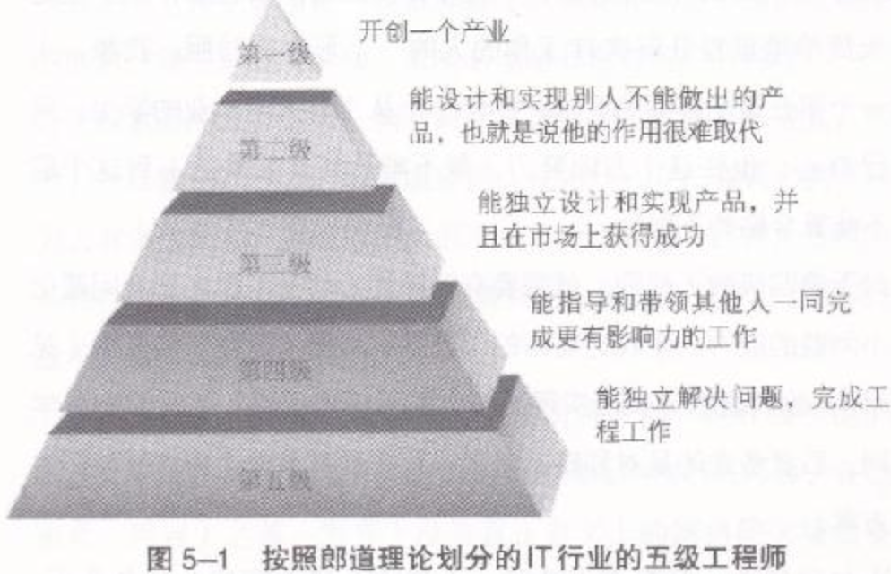

以前有一段时间, 怀疑过自己"软件工程师"和以前工程意义上的"工程师"有什么区别, 自己只是将需求文档换成了代码, 这种活动并没有什么太大的突破. 然后我在吴军的[见识]()书中看了一个五级工程师的概念, 算是解惑了我做为一个"码农"和工程师的区别. 

(图片来源于图书截图)

- 第五级工程师: 有能够独自解决问题的能力, 但是问题规模较小, 属于个人能力可以解决的范围. 
- 第四级工程师: 有沟通和领导能力, 可以带领一个团队, 完成一个规模化的工程.
- 第三级工程师: 能设计和完成一款产品, 取得市场成功. 对行业的商业环境有较深理解, 且有产品思维. 
- 第二级工程师: 能够在行业做出有创造性, 有突破性的产品. 世界因为能够因为他们有一点点不一样.
- 第一级工程师: 开创一个行业的鼻祖. 能够改变世界.

反思自己的工程能力, 目前的所有项目技术上的问题都可以独立解决, 也能够针对某一棘手问题独立设计出可行的解决方案. 但是没有带领过团队解决过规模化问题, 亦没有技术创新. 

所以我自己应该就是 5.0, 五级工程师, 五流程序员.

