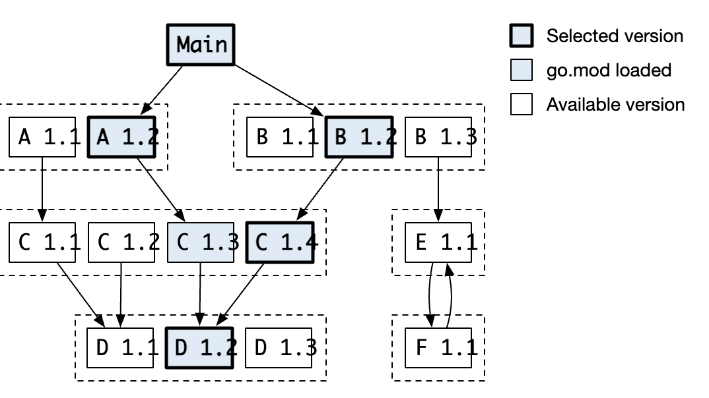

## 是什么

Modules （下文称为模块）是 Go 语言设计用来管理依赖包。

在中文中我们经常把go中的 Module 和 Package 统称为“包”，其实 Module 是一个版本控制的“包”的集合。

模块的引入主要用于解决，项目依赖的不同版本的问题。（在旧的 GOPATH 中不同项目依赖不同版本）。引入的模块会声明在`go.mod`文件中。

### go.mod 文件

```
module example.com/my/thing

go 1.12

require example.com/other/thing v1.0.2
require example.com/new/thing/v2 v2.3.4
exclude example.com/old/thing v1.2.3
replace example.com/bad/thing v1.4.5 => example.com/good/thing v1.4.5
retract [v1.9.0, v1.9.5]
```

文件中各行意思

- module 当前自己模块的名的完整路径
- go 版本号
- require 需要依赖的目标模块以及最小的版本号
- exclude 排除目标模块的特定版本
- replace 将某个模块版本指向另一个模块版本，也可以指向本地，未发布的模块
- retract 当前发布的模块，需要撤回不能用版本，用于处理意外发布版本的情况

`go.mod` 可以通过相关命令修改，也可以直接修改文件数据

### go.sum 文件

与`go.mod`经常在一起的会是一个`go.sum`文件，文件中存放着用于校验依赖源码是否被篡改的 hash 值。

```
> cat go.sum
example.com/mod v1.0.0 h1:6Cz1EhbAk54HWaw6fhCpSPxWGjIMLuF9MlO4Ou568sQ=
example.com/mod v1.0.0/go.mod h1:mgm3p5SY7FVOgVLVSXIYK9qk0umwLQLOG06xLpFUeTI=
```

文件中以：模块路径 + 版本号 + hash算法名 + hash值 的组合写入

- `example.com/mod` 是模块路径名
- v1.0.0 是版本号，在第二行有是以`/go.mod`结尾，代表该 hash 值是对依赖模块本身的`go.mod`文件的 hash 值
- h1: 代表使用的 hash 算法，代表 SHA-256
- 哈希值，没什么好说的了


### Module cache

本地的目录，用户存放下载下来的的模块文件。

默认路径是在`$GOPAth/pkg/mod`

[Module cache 文件夹详细说明](https://go.dev/ref/mod#module-cache)

### 语义化版本

go 采用语义化版本 v1.18.1

一个模块的版本是不变的 —— 只要拉过一次模块，该模块就会存在缓存在[Go 官方的模块服务](https://proxy.golang.org/)中，以后拉取改模块就会从官方的模块服务拉取，且该动作不可逆。

版本号 = "v" + 主版本号 + 小版本号 + 补丁号

- 主版本号的增加后，小版本号和补丁号要重新置零。主版本号增加，代表该版本出现不向前兼容的改动。比如移除旧的包
- 小版本号增加后，补丁号重新置零。表示版本改动公共接口但是向前兼容的，比如增加一个函数
- 补丁号增加，表示该版本对公开接口没有改动。比如修改bug

版本的后面可能还会增加一些提前发布的标识，比如 v1.18.1-beta v1.18.1-pre

当 go 的 模块没有声明发布版本的时候(比如拉取某分支做为模块)，go 就会自己生成 [伪版本](https://go.dev/ref/mod#pseudo-versions), 可以仅作了解。

**如果使用模块的版本号大于等于v2的时候，需要在引入包的后缀加上`/v2`**

```
import "github.com/urfave/cli/v2"
```


## 怎么用

### 开启模块功能

模块功能的开启, 配置在环境变量`GO111MODULE`

- =off, 忽略`GOPATH`路径下的`go.mod`文件，直接引用`GOPATH/src`中的包文件
- =on，启用模块功能
- =auto, 如果项目有`go.mod`文件启用，没有则是用`GOPATH`模式


### 常用命令快览

**go mod**

```
go mod init example.com/example/m1
```
初始化当前文件夹，让其成为一个 module

**go get**

```
go get -d example.com/example/m1@v1.2.3
```
主要用法:修改当前项目的`go.mod`，引入新的依赖项目。

`-d` 的标志，表示获取目标包之后，不进行本地编译或安装。Go 1.18 之后的默认行为。

```
go get -d -u example.com/example/m1
```
也可以用来升级依赖模块的版本，升级到最新版本。如果目标模块的新版的所依赖的其他模块也可能会一并升级。也可以指定版本`-u=patch`

修改制定依赖版本的操作也可以通过制定后缀版本号实现

```
go get example.com/example/m1@v2.3.1
```

**go mod edit**

通过指令修改`go.mod`文件，与直接修改`go.mod`效果一致
 
```
go mod edit -replace example.com/a@v1.0.0=./a
```

将某个模块引用指向本地。可以用来解决引用正在开发中，还没有发布过的模块

**go mod tidy**

根据项目的源码引用整理`go.mod`中的引用情况。添加缺少的依赖，或者移除冗余的依赖。

**go mod vendor**

将项目依赖移入`vendor`文件中，当存在了vendor文件夹，项目会使用vendor中的依赖。大于 1.14 版本需要指定参数`-mod=vendor`才会启用

本地修改之后模块版本之后需要，重新使用`go mod vendor`将新的依赖模块同步入`vendor`中。

**go mod verify**

用于检测模块再被下载之后入，模块中的代码是否有被修改过。

对源码文件的 hash，与当前文件的`go.sum`中的 hash 对比校验是否有被修改过。
如果`go.sum`中没有该模块的hash值，就会从[checksum database](https://sum.golang.org) 中获取目标 hash 值。（除非设置了`GOPRIVATE`或者`GONOSUMDB`)

```
❯ go mod verify
github.com/ynikl/playmod v1.0.0: dir has been modified (/Users/ian/go/pkg/mod/github.com/ynikl/playmod@v1.0.0)
```

上述例子，源文件被我手动强制修改过，就会报错

**go mod why**

```
go mod why example.com/mod
```

用于解释当前项目为什么会依赖某一个模块，输出项目对目标模块的依赖树图

**go list -m all**

可以用于输出当前项目依赖的所有模块


### MVS

*Minimal version selection*（MVS), 当引入的不同模块，又存在依赖与相同模块的（相同大版本，不同版本小版本）的时候。

在使用模块相关命令的时候，会选择所依赖的不同版本的中，构建项目所需要从最小版本。



A.12 与 B1.2 分别需要 C1.3 和 C1.4 为了是项目能正常进行，需要使用 C1.4 版本


## 参考

- [官网Go Modules参考](https://go.dev/ref/mod)
- [Minimal Version Seletion](https://research.swtch.com/vgo-mvs)


