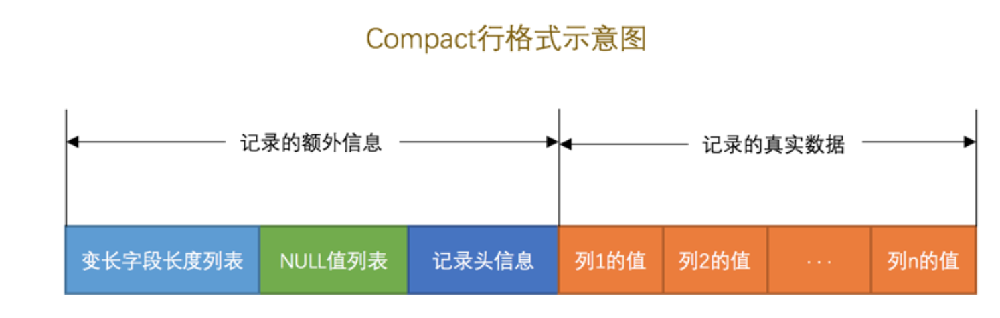
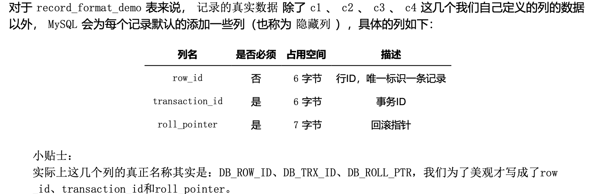
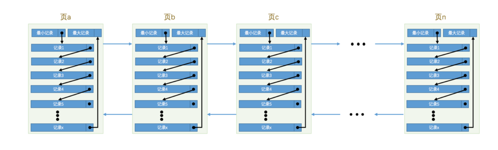
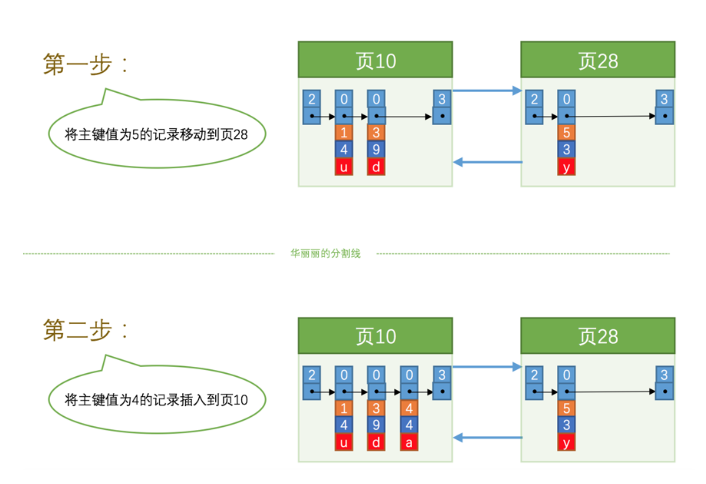
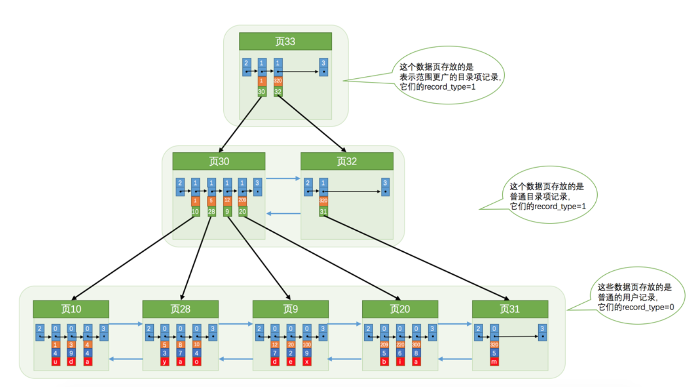
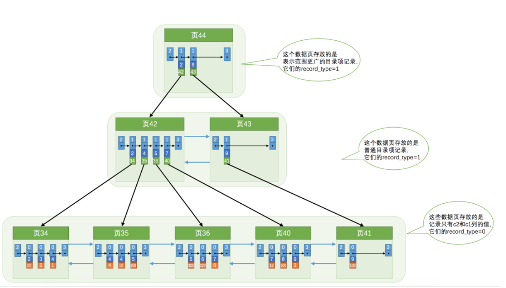
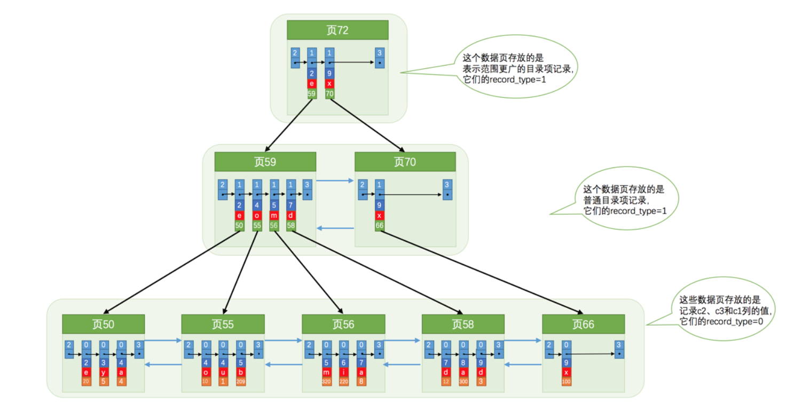

### 字符集和比较规则

我们上边说 utf8 字符集表示一个字符需要使用1~4个字节，但是我们常用的一些字符使用1~3个字节就可以表 示了。而在 MySQL 中字符集表示一个字符所用最大字节长度在某些方面会影响系统的存储和性能，所以设计 
MySQL 的大叔偷偷的定义了两个概念:
utf8mb3 :阉割过的 utf8 字符集，只使用1~3个字节表示字符。 
utf8mb4 :正宗的 utf8 字符集，使用1~4个字节表示字符。 
有一点需要大家十分的注意，在 MySQL 中 utf8 是 utf8mb3 的别名，所以之后在 MySQL 中提到 utf8 就意味着使 用1~3个字节来表示一个字符，如果大家有使用4字节编码一个字符的情况，比如存储一些emoji表情啥的，那请 使用 utf8mb4 。 


SHOW COLLATION LIKE 'utf8\_%';
字符比较规则


MySQL 有4个级别的字符集和比较规则，分别是: 
  服务器级别
  数据库级别
  表级别
  列级别

  
```
CREATE TABLE 表名 (列的信息)
[[DEFAULT] CHARACTER SET 字符集名称] [COLLATE 比较规则名称]
```


```
CREATE TABLE 表名(
列名 字符串类型 [CHARACTER SET 字符集名称] [COLLATE 比较规则名称], 其他列...
);
```


### InnoDB

而我们知道读写磁盘的速度非常慢，和内存读写差了几个数量级，所以当我 们想从表中获取某些记录时， InnoDB 存储引擎需要一条一条的把记录从磁盘上读出来么?不，那样会慢死，
InnoDB 采取的方式是:将数据划分为若干个页，以页作为磁盘和内存之间交互的基本单位，InnoDB中页的大小 一般为 16 KB。也就是在一般情况下，一次最少从磁盘中读取16KB的内容到内存中，一次最少把内存中的16KB 内容刷新到磁盘中。

 InnoDB 存储引擎的大叔们到现在为止设计了4种不同类型的 行格式 ，分别是 Compact 、 Redundant 、
Dynamic 和 Compressed 行格式





变长字段列表

1. 假设某个字符集中表示一个字符最多需要使用的字节数为 W ，也就是使用 SHOW CHARSET 语句的结果中的 Maxlen 列，比方说 utf8 字符集中的 W 就是 3 ， gbk 字符集中的 W 就是 2 ， ascii 字符集中的 W 就是 1。
2. 对于变长类型 VARCHAR(M) 来说，这种类型表示能存储最多 M 个字符(注意是字符不是字节)，所以这个类 型能表示的字符串最多占用的字节数就是 M×W 。
3. 假设它实际存储的字符串占用的字节数是 L 。

如果该可变字段允许存储的最大字节数( M×W )超过255字节并且真实存储的字节数( L ) 超过127字节，则使用2个字节，否则使用1个字节。


NULL 值列表

如果表中没有允许存储 NULL 的列，则 NULL 也不存在了，否则将每个允许存储 NULL 的列对应一个
二进制位，二进制位按照列的顺序逆序排列，二进制位表示的意义如下: 二进制位的值为 1 时，代表该列的值为 NULL 。
二进制位的值为 0 时，代表该列的值不为 NULL 。




 InnoDB 数据页的7个组成部分，知道了各个数据页可以组成一个 双向链表 ，而每个数据页 中的记录会按照主键值从小到大的顺序组成一个 单向链表 ，每个数据页都会为存储在它里边儿的记录生成一个
页目录 ，在通过主键查找某条记录的时候可以在 页目录 中使用二分法快速定位到对应的槽，然后再遍历该槽对 应分组中的记录即可快速找到指定的记录




我们必须通过一些诸如记录移动的操作来始终保 证这个状态一直成立:下一个数据页中用户记录的主键值必须大于上一个页中用户记录的主键值。这个过程 我们也可以称为 页分裂 。





聚簇索引, 数据索引



二级索引



联合索引



- 对于同一个联合索引来说，虽然对多个列都进行范围查找时只能用到最左边那个索引列，但是如果左边的列是精
确查找，则右边的列可以进行范围查找

回表的代理

**需要回表的记录越多，使用二级索引的性能就越低，** 甚至让某些查询宁愿使用全表扫描也不使用 二级索引 。比 方说 name 值在 Asa ~ Barlow 之间的用户记录数量占全部记录数量90%以上，那么如果使用
idx_name_birthday_phone_number 索引的话，有90%多的 id 值需要回表，这不是吃力不讨好么，还不如直接去 扫描聚簇索引(也就是全表扫描)。

覆盖索引

查询列表只包含索引列, 无需回表

#### 索引优化项

- 只为用于搜索、排序或分组的列创建索引
- 为列的基数大的列创建索引 (基数为集合中不同的个数)
- 索引列的类型尽量小 
- 可以只对字符串值的前缀建立索引
- 只有索引列在比较表达式中单独出现才可以适用索引
- 为了尽可能少的让 聚簇索引 发生页面分裂和记录移位的情况，建议让主键拥有 AUTO_INCREMENT 属性。 定位并删除表中的重复和冗余索引
- 尽量使用 覆盖索引 进行查询，避免 回表 带来的性能损耗。


## MySQL 的数据目录

- 一个库一个文件夹
- frm 描述表结构的文件
- ibd 独立表空间描述文件


系统数据库

- mysql

这个数据库贼核心，它存储了MySQL的用户账户和权限信息，一些存储过程、事件的定义信息，一些运行过 程中产生的日志信息，一些帮助信息以及时区信息等。

- information_schema
 
这个数据库保存着MySQL服务器维护的所有其他数据库的信息，比如有哪些表、哪些视图、哪些触发器、哪 些列、哪些索引吧啦吧啦。这些信息并不是真实的用户数据，而是一些描述性信息，有时候也称之为元数 据。

- performance_schema
 
这个数据库里主要保存MySQL服务器运行过程中的一些状态信息，算是对MySQL服务器的一个性能监控。 包括统计最近执行了哪些语句，在执行过程的每个阶段都花费了多长时间，内存的使用情况等等信息。

- sys 

这个数据库主要是通过视图的形式把 information_schema 和 performance_schema 结合起来，让程序员可以
更方便的了解MySQL服务器的一些性能信息。
		  
		  
## JOIN

笛卡尔积

```
select * from t1, t2
```

连接过程

1. 选取代价的表, 作为驱动表, 先获取到查询结果
2. 拿着驱动表获取到的数据, 到 被驱动表 中查询数据

**驱动表中的记录即使在被驱动表中没有匹配的记录，也仍然需要加入到结果集**, 产生了 外连接 和 内连接

- 内连接 ( INNER JOIN)

驱动表中的记录在被驱动表中找不到匹配的记录，该记录不会加入到最后的结果 集，我们上边提到的连接都是所谓的 内连接 。

- 外连接 ( RIGHT JOIN, LEFT JOIN )
 
驱动表中的记录即使在被驱动表中没有匹配的记录，也仍然需要加入到结果集。


在 MySQL 中，根据选取驱动表的不同，外连接仍然可以细分为2种: 

- 左外连接 选取左侧的表为驱动表。
- 右外连接 选取右侧的表为驱动表。


连接中的 where 和 ON

不想把驱动表的所有的数据显示到结果集合中, 产生了 where 和 on

- where 会过滤所有不符合的记录
- on 当外连接的时候, 会显示没有匹配的数据. 在内连接中 where 等价 on. on 被成为连接条件


连接的实现方式

1. 嵌套循环连接
2. 利用索引加速连接
3. 基于块的嵌套循环连接 (批量驱动表数据)


查看表的统计信息

```
SELECT * FROM mysql.innodb_table_stats;
```

```
select * from mysql.innodb_index_stats 
```

子查询结果集分类

1. 标量  单一值 `SELECT (SELECT m1 FROM t1 LIMIT 1);` 
2. 行子查询 单一多个值 `SELECT * FROM t1 WHERE m1 = (SELECT MIN(m2) FROM t2);`
3. 列子查询 一列 `SELECT * FROM t1 WHERE m1 IN (SELECT m2 FROM t2);`
4. 表子查询  `SELECT * FROM t1 WHERE (m1, n1) IN (SELECT m2, n2 FROM t2);`


### 事务

1. 原子性
2. 隔离性
3. 一致性 (提供 check 校验) 通过其他三点保证
4. 持久性 


### redo 

1. 体积小, 页码, 偏移量, 修改值
2. 顺序写入


### MVCC

事物并发问题

1. 脏读, 读到其他事务未提交的数据 (其他事务进行到一半)
2. 脏写, 写到其他事务未提交的数据
3. 不可重复读, 本事务第一次读到A值, 其他事务修改并提交B值, 本事务再读到B值 (不能重复读取到事务开始时的A值)
4. 幻读, 事务开始后, 第二次范围查询的值与第一次范围查询不一致 ( 第一次查询AC, 其他事务插入B, 第二次查询 ABC)o

MySQL 的隔离等级

1. Read Uncommitted
2. Read committed 以提交读
3. Repeadted Read
4. Serializable


- trx_id
- roll_pointer

### 锁

- 一致性读 ( 普通读 )
- 锁定读 
  - S 共享锁 `select ... lock in share mode;`
  - X 排他锁 `select ... for update;`
  

意向锁: 当要对行加锁时, 在表上面加的锁, 方便快速知道该表是否可能直接加表锁. 

IS、IX锁是表级锁，它们的提出仅仅为了在之后加表级别的S锁和X锁时可以快速判断表中的记录是否 被上锁，以避免用遍历的方式来查看表中有没有上锁的记录，也就是说其实IS锁和IX锁是兼容的，IX锁和IX锁是 兼容的


行级锁

- `LOCK_REC_NOT_GAP`
- `GAP Locks`  锁住当前记录的前方数据间隙, 用于解决幻读问题(与MVCC同时起作用). 引入两个伪记录 `Infimun, Supermum`
- `Next-Key Locks` 记录锁 + 间隙锁

